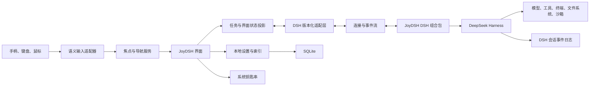

# JoyDSH 产品与技术方案

## 一、方案摘要

JoyDSH 是一个手柄优先、键盘友好的本地智能体工作空间。产品以开发任务而不是文件编辑为中心，通过主机系统式的空间导航组织工作空间、任务会话、执行状态、审批和工作成果。

DeepSeek Harness 负责模型、工具、会话事件、智能体循环、沙箱和插件能力；JoyDSH 负责桌面外壳、手柄输入、焦点管理、任务编排视图和本地用户体验。两者通过版本化适配层连接，JoyDSH 不派生官方网页界面。

首版优先支持 macOS 和 Windows 桌面环境、DualSense 与 Xbox 兼容手柄。除长文本输入外，完整任务流程必须可以不用鼠标完成。

## 二、产品目标

### 2.1 核心目标

1. 用手柄完成工作空间切换、任务恢复、计划查看、审批、成果检查和常用命令。
2. 让一个前台任务保持沉浸，同时不丢失后台任务、审批和通知。
3. 保留键盘处理长文本和代码输入的效率，不把手柄伪装成鼠标。
4. 让用户能够在“标准权限”和“完全访问”之间明确选择。
5. 将 DeepSeek Harness 的快速变化隔离在适配层内，不污染产品界面和领域模型。

### 2.2 首版不做

- 不实现完整代码编辑器。
- 不实现复杂 Git 合并和托管平台客户端。
- 不实现云账号、云同步和团队协作后台。
- 不实现插件商店。
- 不把语音输入作为首版阻塞项。
- 不为电视远场环境单独设计布局。
- 不提供复杂的多智能体调度台，只展示子任务和后台执行状态。
- 不复制 PlayStation 的商标、图标、声音、动画或视觉资产。

## 三、目标用户与使用场景

### 3.1 目标用户

- 已经使用智能体完成编码、研究、文档和自动化任务的开发者。
- 希望降低鼠标使用频率，或更偏好靠背、站立、沙发等姿势工作的用户。
- 需要在多个长时间运行任务之间快速切换、审批和检查结果的用户。

### 3.2 核心任务闭环

```text
启动 JoyDSH
  → 选择工作空间
  → 创建或恢复任务会话
  → 输入目标
  → 查看计划与实时执行
  → 处理必要审批
  → 检查文件变更和成果
  → 继续、回滚、提交或结束任务
```

## 四、产品信息架构

### 4.1 一级结构

```text
首页
├── 工作空间轨道
│   └── 任务列表
├── 前台任务
│   ├── 执行流
│   ├── 计划
│   ├── 变更
│   ├── 成果
│   └── 详情检查器
├── 命令中心
│   ├── 任务切换
│   ├── 待处理审批
│   ├── 通知
│   └── 常用命令
└── 设置
    ├── 模型与凭据
    ├── 权限预设
    ├── 手柄与按键
    ├── 显示与辅助功能
    └── DeepSeek Harness 运行时
```

### 4.2 首页

首页采用横向工作空间轨道。选中工作空间后，在同一视图中纵向展开任务列表；正在运行、有待审批和最近使用的任务优先排列。

```text
┌──────────────────────────────────────────────────────────────┐
│ JoyDSH                 运行时正常       2 个后台任务       设置 │
├──────────────────────────────────────────────────────────────┤
│  工作空间 A     [工作空间 B]     工作空间 C      添加工作空间  │
├──────────────────────────────────────────────────────────────┤
│ 工作空间 B                                                   │
│                                                              │
│ ● 修复登录问题              执行中               12 分钟      │
│ ! 重构权限模块              等待审批                          │
│ ✓ 整理接口文档              已完成                            │
│   新建任务                                                   │
└──────────────────────────────────────────────────────────────┘
```

首页不做应用启动器，也不混放插件和文件。用户的第一判断始终是“在哪个工作空间继续哪个任务”。

### 4.3 前台任务

前台任务占据完整主视图。宽屏下，左侧为任务执行流，右侧为当前焦点对应的检查器；较窄窗口中，检查器作为可切换页面出现。

```text
┌───────────────────────────────────────┬──────────────────────┐
│ 修复登录问题                 执行中    │ 当前步骤             │
│                                       │                      │
│ 目标                                  │ 修改认证中间件        │
│ 修复刷新令牌失效后的循环跳转          │                      │
│                                       │ 涉及文件             │
│ 计划  3/5                             │ auth/session.ts       │
│ ✓ 复现问题                            │ auth/refresh.ts       │
│ ● 修改会话恢复逻辑                    │                      │
│ ○ 补充测试                            │ 查看差异              │
│                                       │                      │
│ 智能体执行流                          │ 权限：标准权限        │
│ ……                                    │                      │
├───────────────────────────────────────┴──────────────────────┤
│ 输入目标或继续说明                                      发送 │
└──────────────────────────────────────────────────────────────┘
```

### 4.4 命令中心

命令中心是覆盖在当前界面底部的临时操作层，不改变用户所在页面。它只承载需要跨页面访问的高频操作：

- 切换前台和后台任务。
- 集中处理待审批操作。
- 查看完成、失败和断连通知。
- 暂停或停止智能体。
- 打开全局搜索、运行时状态和设置。

命令中心关闭后，焦点必须回到打开前的位置。

## 五、手柄交互模型

### 5.1 原则

1. 手柄输入是语义动作，不是鼠标指针模拟。
2. 每个页面必须定义焦点进入点、移动关系、恢复位置和退出路径。
3. 焦点移动必须可预测；动态内容不得让焦点跳到无关区域。
4. 所有高频非文本操作必须能够只用手柄完成。
5. 实体键盘、鼠标和手柄共享同一套操作语义，切换设备时不重置页面状态。

### 5.2 默认动作映射

| 语义动作 | 默认手柄输入 | 用途 |
| --- | --- | --- |
| 确认 | 南侧按键 | 进入、选择、执行普通操作 |
| 返回 | 东侧按键 | 返回上一层、关闭临时界面 |
| 主要操作 | 西侧按键 | 当前项目的高频动作 |
| 更多操作 | 北侧按键 | 打开上下文操作菜单 |
| 精确移动 | 十字键 | 在相邻焦点之间移动 |
| 快速移动 | 左摇杆 | 连续移动焦点或列表滚动 |
| 内容滚动 | 右摇杆 | 阅读日志、差异和长文档 |
| 上一个或下一个区域 | 左、右肩键 | 切换一级焦点区域 |
| 上一个或下一个内容页 | 左、右扳机键 | 切换计划、变更、成果等页面 |
| 命令中心 | 菜单键 | 打开或关闭命令中心 |
| 立即暂停 | 长按菜单键 | 暂停当前智能体执行 |

按键提示根据已识别的控制器显示 DualSense 或 Xbox 图标。系统键可能被操作系统占用，因此“回到 JoyDSH 首页”不得只依赖系统键；菜单键必须始终可用。

### 5.3 焦点规则

- 页面进入时优先恢复上次焦点；没有历史时进入主要任务。
- 焦点位置由稳定标识保存，不由列表序号保存。
- 焦点目标消失时，优先落到同组下一项，其次上一项，最后回到组入口。
- 打开菜单、审批或命令中心时保存焦点栈；关闭后原路恢复。
- 长列表使用虚拟化，但焦点逻辑以完整数据集合为准。
- 焦点反馈同时使用边框、亮度和轻微尺度变化，不只依赖颜色。
- 动画时长控制在 120 至 220 毫秒，并提供减少动态效果选项。

### 5.4 文字输入

- 长文本默认使用实体键盘。
- 支持语音输入联动：通过系统底层按键模拟（如 macOS `Right Command` / `0x36`）桥接 Spokenly、Superwhisper 或系统原生听写，手柄 Select 键或快捷键一键唤起并自动聚焦任务输入框。
- 手柄可以调用系统屏幕键盘，适合短命令、搜索和补充说明。
- 输入框聚焦时，十字键仍用于候选词或光标相关操作；退出输入模式后恢复空间导航。

## 六、任务与并发模型

- 工作空间和任务会话数量不设上限。
- 同时最多执行三个任务：一个前台任务、两个后台任务。
- 超出并发上限的任务进入队列，可手动调整顺序。
- 后台任务不会弹出阻断窗口；审批统一进入命令中心。
- 切换前台任务不暂停原任务，除非并发策略要求让出执行名额。
- 任务状态至少包含：草稿、排队、执行中、等待输入、等待审批、已暂停、已完成、失败。
- DeepSeek Harness 重启后，通过持久会话事件恢复任务状态，而不是依赖 JoyDSH 内存快照猜测。

## 七、权限与安全

### 7.1 权限预设

**标准权限**是默认模式：

- 文件读写默认限制在当前工作空间。
- 普通只读操作可自动允许。
- 工作空间外访问、安装依赖、长期进程和敏感路径操作需要审批。
- 删除、覆盖、强制推送等破坏性操作默认拒绝；用户显式允许后仍需长按确认。
- 审批展示完整命令、影响范围、风险等级和可恢复性。

**完全访问**等同 Codex 的全部权限模式：

- 智能体继承当前系统用户拥有的文件系统、网络和命令执行权限。
- 不再逐项审批，也不额外拦截破坏性命令。
- 可在创建任务时选择，也可保存为工作空间默认值。
- 前台任务和命令中心持续显示“完全访问”状态。
- 固定的“立即暂停”操作始终有效。

完全访问不是标准权限中的临时漏洞，而是独立、明确、可审计的权限预设。

### 7.2 本地优先

- JoyDSH 的工作空间索引、界面偏好和运行时配置保存在本机。
- DeepSeek Harness 继续拥有任务会话事件日志，JoyDSH 只保存会话标识和界面投影。
- 模型凭据保存在系统钥匙串，不写入普通配置文件或界面数据库。
- 首版不建设 JoyDSH 云端账号和同步服务。
- 模型请求仍按用户选择的模型提供方规则发送到网络。

## 八、系统架构

### 8.1 总体结构



### 8.2 进程边界

**JoyDSH 桌面进程**：

- 使用 Tauri 2 承载桌面窗口、系统集成、进程管理和安全存储。
- 负责启动、停止和健康检查受管 DeepSeek Harness。
- 不直接实现智能体循环、工具执行或会话日志。

**JoyDSH 前端**：

- 使用 React、TypeScript 和 Vite。
- 负责界面、空间导航、焦点、任务投影和控制器提示。
- 不直接依赖 DeepSeek Harness 内部服务对象，只依赖 JoyDSH 适配接口。

**受管 DeepSeek Harness 进程**：

- 锁定经过兼容性验证的 DSH 和 Node.js 版本。
- 使用专用的 JoyDSH profile 和组合包启动。
- 提供会话、智能体、计划、审批、成果和运行状态能力。
- 默认只监听本机回环地址。

### 8.3 DSH 集成方式

JoyDSH 不加载官方网页界面，而是构建专用 DSH 组合包：

```text
dsh-base
  + 会话与持久化
  + 模型和工具
  + 文件、终端、沙箱与权限策略
  + API Gateway 与 Connection
  + JoyDSH 桥接插件
  + JoyDSH 权限预设插件
```

一元命令通过 DSH 的类型化远程调用能力完成，例如创建任务、发送输入、停止任务和回应审批。会话事件、流式模型输出和增量状态通过独立事件流传输，不伪装成普通远程方法，也不依赖高频轮询。

### 8.4 版本化适配层

适配层向界面暴露稳定能力：

```text
运行时：启动、停止、重启、健康检查、版本和能力协商
工作空间：添加、移除、选择、最近使用
任务会话：创建、恢复、列出、发送、暂停、停止、派生
事件：订阅、续接、回放、缺口修复
审批：列出、允许、拒绝
成果：文件、差异、计划、终端结果和生成文件
权限：读取和切换标准权限、完全访问
```

所有 DSH 特定类型必须在适配层内转换成 JoyDSH 领域类型。每个支持的 DSH 版本都运行同一套契约测试；不满足契约时拒绝自动升级。

### 8.5 外部运行时

首版默认使用受管本地运行时，同时保留连接外部 DSH 的高级入口。外部连接必须经过能力协商；远程连接的认证、传输加密和网络暴露不属于首版范围，不允许直接把无认证的本地服务绑定到公共网络。

## 九、建议工程结构

```text
JoyDSH/
├── apps/
│   └── desktop/                 Tauri 与 React 桌面应用
├── packages/
│   ├── domain/                  JoyDSH 领域类型与状态
│   ├── input/                   语义动作与控制器适配
│   ├── focus/                   空间导航与焦点服务
│   ├── dsh-adapter/             版本化 DSH 客户端适配层
│   ├── task-projection/         会话事件到界面状态的投影
│   └── ui/                      共享界面组件与主题
├── dsh/
│   ├── profile/                 JoyDSH DSH profile
│   └── plugins/                 桥接和权限插件
├── docs/
│   └── adr/                     架构决策
└── CONTEXT.md                   统一领域语言
```

建议采用 pnpm 工作空间管理 TypeScript 包，Rust 部分保留在 Tauri 应用中。首版先使用网页 Gamepad API；若 macOS、Windows 或特定手柄的兼容性测试不足，再增加 Rust 原生输入提供方，不提前维护两套实现。

## 十、视觉与动效方向

- 使用深灰、中性白作为基础，青色表示当前焦点，绿色表示完成，琥珀色表示等待，红色只用于错误和高风险状态。
- 不使用大面积单色渐变、装饰光球或纯氛围背景。
- 页面区域采用全宽层次，不使用卡片套卡片；卡片圆角不超过 8 像素。
- 首页强调工作空间名称和任务状态，不使用营销式大标题。
- 焦点动效短促、稳定，不依赖弹性晃动；长日志更新不得造成布局跳动。
- 任务执行状态优先通过文字、图标和进度共同表达，不只依赖颜色或动画。
- 提供高对比度、减少动态效果和界面缩放设置。

## 十一、Git 与成果检查

首版包含：

- 工作空间文件树。
- 任务产生的文件清单。
- 结构化差异查看。
- 按文件接受或拒绝变更。
- 回滚当前任务产生的变更。
- 请求智能体生成提交说明并执行提交。

首版不包含：

- 通用代码编辑器。
- 复杂冲突解决器。
- 分支图形化管理。
- GitHub、GitLab 等托管平台完整客户端。

回滚必须基于任务开始边界和实际版本控制状态，不允许用不受约束的文件覆盖模拟撤销。

## 十二、实施路线图

### 阶段零：技术验证，约一周

- 验证自定义 DSH profile、API Gateway 和会话事件订阅。
- 验证 Tauri 管理固定版本 DSH 进程和异常恢复。
- 验证 DualSense 与 Xbox 兼容手柄在 macOS、Windows 的按键识别。
- 验证一个真实任务从创建到流式完成的最小链路。

**退出条件**：不用官方网页界面即可创建任务、发送输入、接收事件并停止任务。

### 阶段一：手柄交互原型，约两周

- 使用模拟数据完成首页、前台任务和命令中心。
- 实现语义动作、焦点图、焦点恢复和设备切换。
- 建立控制器映射和自动化导航测试。
- 完成基础视觉系统和减少动态效果模式。

**退出条件**：核心原型可用两类手柄完整导航，任何界面都不存在焦点陷阱。

### 阶段二：真实任务纵向闭环，约三周

- 接入工作空间、任务会话、事件流和运行时恢复。
- 接入计划、执行状态、暂停和停止。
- 实现标准权限与完全访问。
- 实现本地索引、系统钥匙串和运行时版本管理。

**退出条件**：能够在真实项目中完成一次智能体任务，并在 DSH 重启后恢复。

### 阶段三：检查与多任务，约三周

- 接入审批、文件、差异和成果。
- 实现一个前台加两个后台执行任务。
- 实现队列、通知和命令中心聚合。
- 实现按任务回滚和智能体提交。

**退出条件**：用户可用手柄完成从恢复任务到检查、回滚或提交的完整闭环。

### 阶段四：稳定与发布，约两周

- 完成 macOS、Windows 安装包与升级策略。
- 完成 DSH 契约测试、崩溃恢复和长会话性能测试。
- 完成手柄断连、重连、睡眠唤醒和窗口切换测试。
- 完成可访问性、安全审计和首版使用说明。

**退出条件**：达到下述 MVP 验收标准，可供小范围真实用户持续使用。

## 十三、MVP 验收标准

### 13.1 交互

- 除长文本输入外，核心任务闭环可以完全不用鼠标完成。
- 从首页恢复最近任务不超过三次按键。
- 任意界面的下一焦点可预测，并且始终存在明确返回路径。
- 手柄断开后键鼠操作不中断，重新连接后恢复正确焦点。
- 焦点输入到视觉反馈的延迟不高于 100 毫秒。

### 13.2 任务

- 支持一个前台任务和两个后台执行任务。
- 审批来源、命令、影响范围和权限模式始终可见。
- 流式事件在本机正常负载下 250 毫秒内反映到界面。
- DSH 进程重启后能够恢复工作空间、任务历史和未完成状态。

### 13.3 兼容性

- 支持 macOS 和 Windows 当前主流版本。
- 支持 DualSense 与 Xbox/XInput 两类控制器。
- 支持键盘和鼠标作为完整备用输入。
- DSH 升级必须通过适配层契约测试才能进入受管版本。

## 十四、主要风险与应对

| 风险 | 影响 | 应对 |
| --- | --- | --- |
| DSH 处于开发者预览阶段 | 接口变化导致集成失效 | 锁定版本、隔离适配层、建立能力协商和契约测试 |
| 手柄在不同系统上的映射不一致 | 按键错误或系统键不可用 | 使用语义动作、平台映射表和真实硬件兼容测试 |
| 空间导航在动态列表中失控 | 焦点丢失、跳转和陷阱 | 稳定标识、显式焦点图、恢复规则和自动化路径测试 |
| 长会话与高频事件造成卡顿 | 界面延迟和滚动抖动 | 增量投影、虚拟化、按帧合并可见更新、事件缺口修复 |
| 受管 Node.js 与 DSH 增大安装体积 | 下载和升级成本提高 | 分层打包、差分升级、明确第三方许可，不以牺牲可重复性换体积 |
| 完全访问可能造成不可恢复修改 | 数据和代码损失 | 权限状态持续可见、保留审计和立即暂停；不虚假承诺额外拦截 |
| JoyDSH 与 DSH 双重持久化 | 状态冲突和恢复错误 | DSH 拥有会话事实，JoyDSH 只保存索引与可重建投影 |

## 十五、关键决策结论

1. JoyDSH 是任务优先的智能体工作空间，不是传统集成开发环境或桌面启动器。
2. 产品采用独立 Tauri 外壳，不派生 DeepSeek Harness 官方网页界面。
3. 控制器输入使用语义动作与受控焦点，不进行鼠标模拟。
4. 首页使用横向工作空间和纵向任务列表；一个任务占据主要工作视图。
5. 后台任务、审批和通知通过命令中心集中处理。
6. 首版以实体键盘承担长文本，语音输入后置。
7. 权限同时提供标准权限和等同 Codex 全部权限的完全访问。
8. 数据本地优先，DSH 会话日志是任务事实的唯一来源。
9. 首版聚焦 macOS、Windows、DualSense 和 Xbox 兼容手柄。
10. MVP 以一条真实、稳定、无需鼠标的任务闭环作为完成标准。

